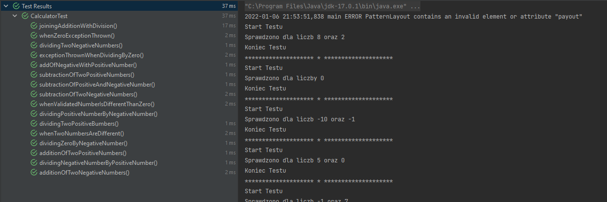

Pierwsze repozytorium z Zadaniem nr 1 dostepne pod adresem:
https://github.com/R4V88/TAU_Zadania

Zadanie 5 czyli dopisanie testów do Zadania 1:
Dopisano 2 dependencje -> dla Loggera oraz dla Cucumbera.
Do klasy CalculatorTest dopisano kolejne testy:

Utworzono klase CucumberCalculatorTest zzawierajaca scenariusz testowy (zawiera 7 testow / assercji)

